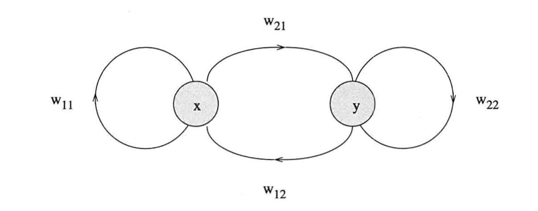
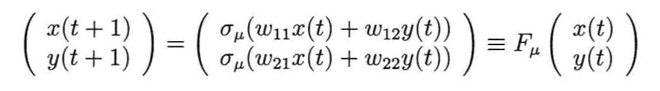
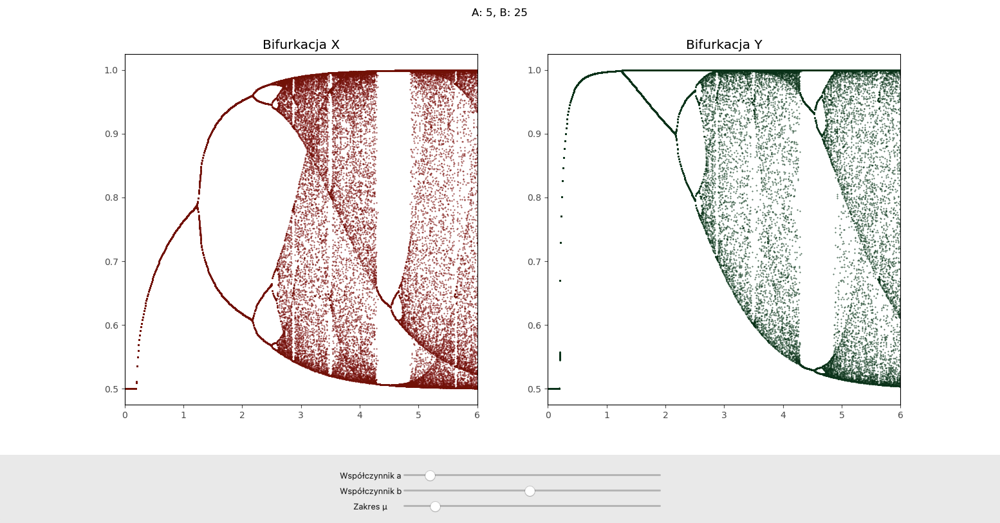

# FIZYKA OGÓLNA 23Z
## PROJEKT - *Chaos deterministyczny w prostej sieci neuronowej*

### Autorzy
- **Jamróz Aleksandra** 310708
- **Rogoziński Karol** 310883

### Opis zadania
Naszym celem było odwzorowanie zjawiska chaosu zachodzącego w prostej sieci neuronowej. Swoją pracę oparliśmy o artukuł naukowy [Period-Doublings to Chaos in a Simple Neural Network: An Analytical Proof](https://wpmedia.wolfram.com/uploads/sites/13/2018/02/05-4-6.pdf), Xin Wang, 1991.

### Implementacja algorytmu

Zgodnie z publikacją stworzyliśmy sieć neuronową o następującej strukturze:



Wagi sieci oparte są o dwa współczynniki w następujący sposób:

|w11 = a|w12 = ka|
|-|-|
|**w21 = b**|**w22 = kb**|

Gdzie **k** = -1.

Stan sieci aktualizowany jest w czasie dyskretnym według formuły:



Funkcją aktywacji σ jest sigmoida ze współczynnikiem nachylenia μ.

Dane wejściowe zostały zainicjowane wartościami:
    - *x(0)* = 0.35,
    - *y(0)* = 0.55.

Parametry do eksperymentów (liczba iteracji, gęstość próbkowania μ) zostały wyznaczone metodą inżynierską.

### Aplikacja

Nasza aplikacja prezentuje prosty interfejs do obserwacji bifurkacji opisanej powyżej sieci neuronowej, w zależności od wartości parametrów a i b w danym zakresie μ.



Aplikację można uruchomić z wykorzystaniem języka python w wersji 3.9+, w następujący sposób:
```
$pip3 install -r requirements.txt
$python3 projekt.py
```

### Wnioski

Możemy zaobserwować, że chaos deterministyczny jest bardzo popularnym zjawiskiem w zaimplementowanej przez nas sieci neuronowej. W zależności od ustawionych wag, układ posiada różne wartości parametru μ, dla których wpada w oscylacje (pionowe, poszarpane linie). Zwykle jest stabilny jedynie dla bardzo małych wartości μ (ciągłe poziome linie).
